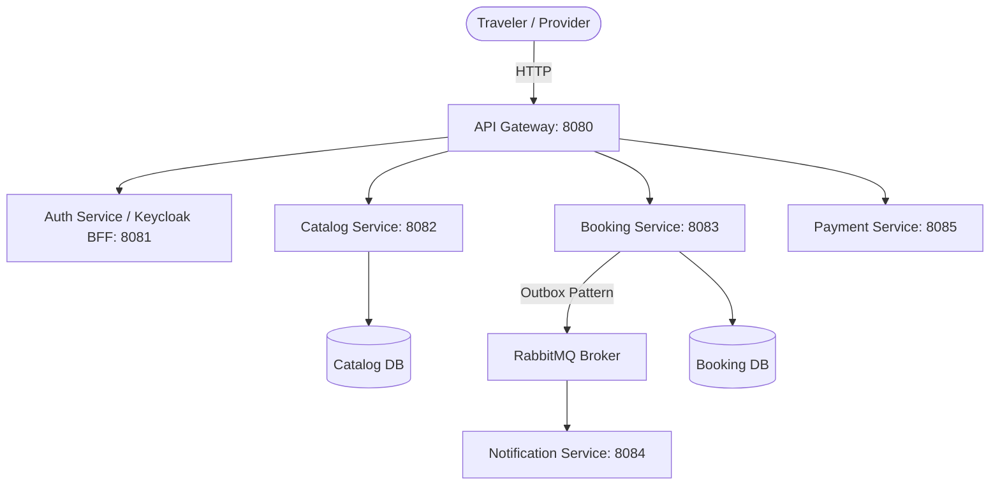

# Blue Ceylon: Traveler Discovery & Booking Platform

Blue Ceylon is a premium traveler discovery and booking platform tailored for the Sri Lankan tourism ecosystem. The platform connects travelers with local service providers, enabling them to discover and book accommodations, short experiences, tour packages, and private tour guides.

---

## 1. Project Vision & Core Features

Blue Ceylon is designed to offer a cohesive, trustworthy, and visually stunning experience for travelers exploring Sri Lanka.

### Core Pillars
*   **Unified Discovery**: A single platform to find and compare hotels, homestays, tour agencies, and tour guides.
*   **Diverse Booking Models**:
    *   **Hotels/Stays**: Nightly room bookings.
    *   **Short Experiences**: Day Out packages (pool access + lunch), Night Out packages (gala/dinner events), and Hourly room stays (ideal for transit travelers/layovers).
    *   **Tours**: Fixed tour packages and private tour guide hires. (Note: Booking for tour packages in the first launch is handled via direct contact/chat, whereas accommodation and short experiences are fully automated).
*   **Verified Trust**: A trust system consisting of verification badges (backed by SLTDA license checks) and a verified-stay review system.

---

## 2. System Architecture & Authentication Pattern

The platform uses a microservices architecture built with Spring Boot, Keycloak, PostgreSQL, RabbitMQ, and Next.js.



### Authentication Pattern: Backend-For-Frontend (BFF)
> **IMPORTANT NOTE FOR FRONTEND DEVELOPERS & AI AGENTS**:
> The Next.js frontend **does NOT redirect users directly to Keycloak's hosted UI**. Instead, we use a **Backend-For-Frontend (BFF)** pattern with custom branded forms in Next.js:
>
> 1. **Custom Forms**: Next.js renders branded `/login` and `/register` pages.
> 2. **Auth Service Orchestration**: When a user registers or logs in, Next.js sends a REST request to `POST http://localhost:8080/api/auth/register` or `POST http://localhost:8080/api/auth/login`.
> 3. **Keycloak Encapsulation**: The Spring Boot `auth-service` encapsulates Keycloak server-side via `KeycloakAdminClient` (for user creation/role assignment) and `KeycloakTokenExchangeClient` (for exchanging credentials for OAuth2 JWTs). It also syncs profiles to PostgreSQL and triggers welcome emails via RabbitMQ.
> 4. **NextAuth Integration**: Next.js uses NextAuth `CredentialsProvider` to call `/api/auth/login` and store the returned Keycloak JWT in an encrypted session cookie.
> 5. **Stateless Bearer Tokens**: All downstream services (`catalog-service`, `booking-service`) validate the Bearer JWT statelessly using Spring Security.

### Microservices Catalog
1.  **`auth-service` / Keycloak (Port 8081)**:
    *   Handles user registrations, logins, security tokens (JWT), and user profiles via BFF endpoints (`/api/auth/register`, `/api/auth/login`).
    *   Manages three primary roles: `TRAVELER`, `BUSINESS_OWNER`, and `ADMIN`.
2.  **`catalog-service` (Port 8082)**:
    *   Manages Business Profiles (Hotels, Tour Agencies, Tour Guides).
    *   Manages inventory types (Rooms, Day/Night Out Packages, Tour Packages).
    *   Provides public search and filtering APIs.
    *   Manages the Review & Rating system.
3.  **`booking-service` (Port 8083)**:
    *   Maintains the reservation ledger and date-based inventory locks (e.g., checking room availability and preventing double-booking).
    *   Implements an asynchronous transactional outbox to publish booking events.
    *   Runs a background sweeper service to auto-release pending/unpaid bookings after expiration.
4.  **`notification-service` (Port 8084)**:
    *   Listens to RabbitMQ messages generated by the booking service.
    *   Sends beautifully styled HTML emails (via Brevo SMTP) to travelers and business owners for booking confirmations, cancellations, and status changes.
5.  **`payment-service` (Port 8085)**:
    *   Ready for PayHere gateway integration (MVP currently defaults to the **Pay at Property** flow).

---

## 3. Public Search & Review APIs Reference

These endpoints are open to the public (`/public/**`) and form the core data source for the frontend discovery flows.

### 3.1 Search & Filtering

#### Search Businesses (Card View)
Returns a simplified summary of approved businesses to display as profile cards on listing pages.
*   **Endpoint**: `GET /api/v1/catalog/public/search/businesses`
*   **Query Parameters**:
    *   `type`: `HOTEL`, `TOUR_AGENCY`, `TOUR_GUIDE` (Optional)
    *   `city`: Enum `SriLankanCity` (Optional)
    *   `page`, `size`: Pagination parameters
*   **Example Response**:
    ```json
    {
      "content": [
        {
          "id": "business-uuid-1",
          "name": "Ella Mount Haven",
          "tagline": "Boutique hillside stays above Ella",
          "type": "HOTEL",
          "city": "ELLA",
          "coverImageUrl": "https://images.example.com/cover1.jpg",
          "averageRating": 4.8,
          "reviewCount": 24
        }
      ],
      "totalPages": 1,
      "totalElements": 1
    }
    ```

#### Search Rooms
Finds specific rooms matching location and price budgets.
*   **Endpoint**: `GET /api/v1/catalog/public/search/rooms`
*   **Query Parameters**: `city` (Optional), `minPrice` (Optional), `maxPrice` (Optional), `page`, `size`

#### Search Tours
Finds tour packages with provider filters.
*   **Endpoint**: `GET /api/v1/catalog/public/search/tours`
*   **Query Parameters**: `city`, `category` (`ADVENTURE`, `WILDLIFE`, `CULTURAL`, `BEACH`), `providerType` (`TOUR_AGENCY` or `TOUR_GUIDE`), `minPrice`, `maxPrice`, `page`, `size`

---

### 3.2 Review & Rating System

To build trust, hotel-related reviews require a verified booking ID, while guide/tour reviews require only traveler authentication.

*   **Submit Review**: `POST /api/v1/catalog/reviews` (Requires Auth)
    *   Request body:
        ```json
        {
          "reviewerName": "John Doe",
          "rating": 5,
          "comment": "Incredible stay and hospitality!",
          "entityType": "HOTEL",
          "entityId": "hotel-uuid",
          "stayOrTourDate": "2026-07-20",
          "bookingId": "booking-uuid"
        }
        ```
*   **Get Reviews**: `GET /api/v1/catalog/public/reviews?entityId={id}&entityType={type}` (Public)
*   **Respond to Review**: `PUT /api/v1/catalog/reviews/{reviewId}/respond` (Requires Auth - Business Owner)

---

## 4. Frontend Specifications: Next.js + TypeScript

The frontend is a next-generation web application built in the `frontend/` directory.

### Tech Stack
*   **Framework**: Next.js (App Router recommended for modern layouts, server actions, and optimal SEO routing).
*   **Language**: TypeScript (for strong type safety across API payloads).
*   **Styling**: Vanilla CSS or TailwindCSS (configured with rich aesthetics).
*   **Authentication**: NextAuth.js (`CredentialsProvider` targeting `/api/auth/login`).

### Design Aesthetics & UI/UX Expectations
Frontend developers must follow these principles:
*   **Premium Visuals**: Use curated color palettes (deep ocean blues, golden sands, and lush green accents matching Sri Lanka's environment), smooth gradients, dark mode support, and glassmorphism.
*   **Typography**: Clean sans-serif fonts (e.g., *Inter*, *Outfit*, or *Cabinet Grotesk*).
*   **Motion**: Subtle micro-animations (e.g., card hover lift effects, smooth page transitions, fade-in skeletons during pagination fetches).
*   **Responsive layouts**: Multi-column grids for cards that gracefully scale from mobile devices up to large desktop viewports.

---

## 5. Main Frontend Workflows to Build

### 1. Homepage & Exploration Dashboard
*   A hero section highlighting Sri Lanka's destinations.
*   A universal search bar allowing quick jumps to stays or tours.
*   Spotlights on "Verified" businesses and highly rated packages.

### 2. Search & Filter Results Page
*   Left-hand or top sticky filter drawer (City, price range, property type, guide languages, etc.).
*   A clean grid of summary cards using the `/search/businesses` endpoint.

### 3. Detailed Business/Guide Profiles
*   **Hotels**: Gallery layout, amenities, interactive map, list of rooms, short-experience options (Day Out/Night Out passes), and reviews listing.
*   **Guides**: Tour Guide bio, SLTDA license details, languages, daily/half-day rates, and calendar showing blackout dates.

### 4. Booking Checkout Flow
*   Interactive date-range selectors checking room/package availability.
*   Form collecting traveler details, mapping to the "Pay at Property" option.
*   Redirect to Next.js custom `/login` page if the traveler tries to complete a checkout while unauthenticated.

---

## 6. How to Run the Environment

### Infrastructure
Start the required databases, message broker, and IAM service using Docker:
```bash
docker-compose up -d
```
*   **PostgreSQL**: `localhost:5433`
*   **RabbitMQ Management Console**: `localhost:15672`
*   **Keycloak Admin**: `localhost:8081`

### Running Backend Services
Navigate to each service folder in `services/` and run:
```bash
mvn spring-boot:run
```

### Initializing Frontend
Once the frontend is bootstrapped:
```bash
cd frontend
npm install
npm run dev
```
The frontend should be accessible at `http://localhost:3000`.
